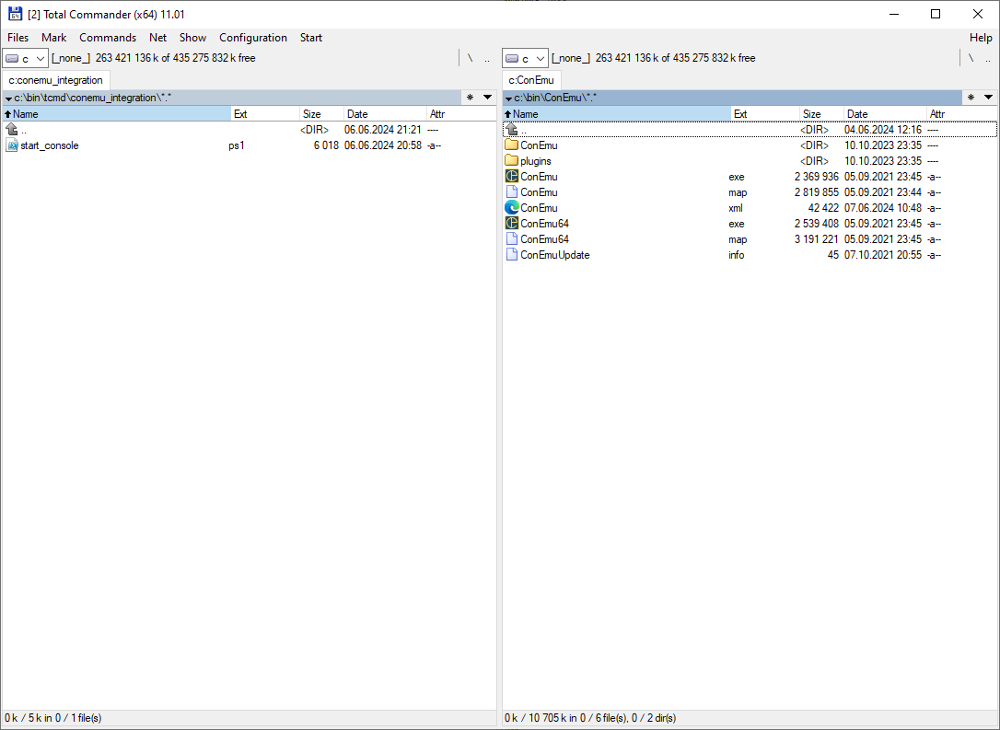
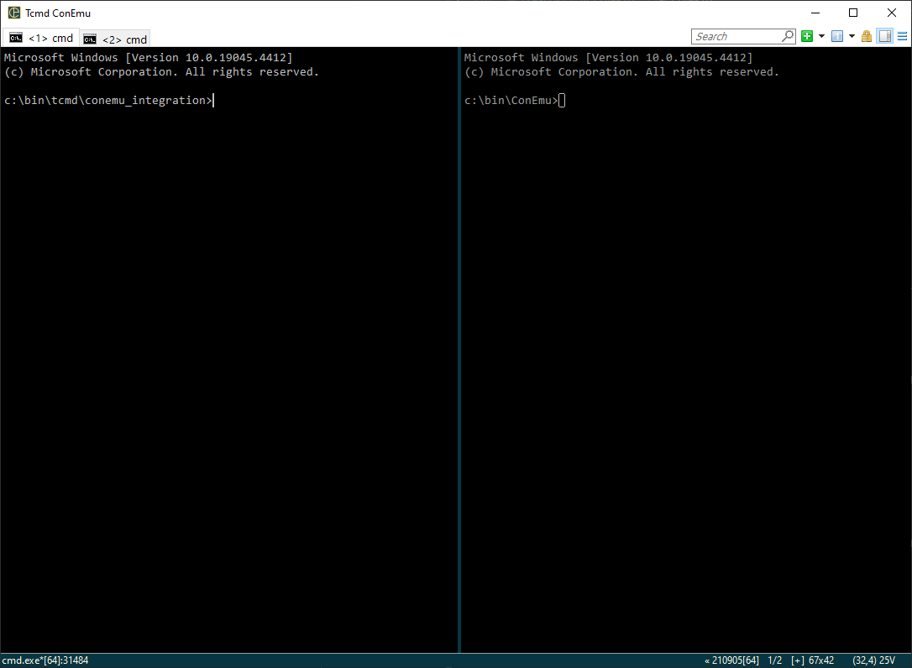
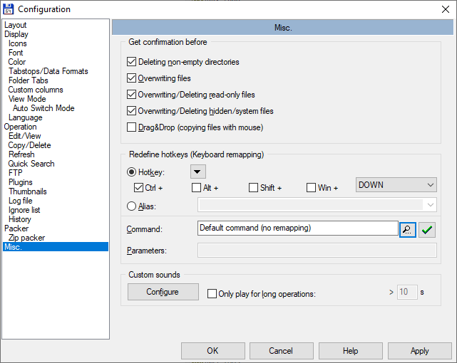
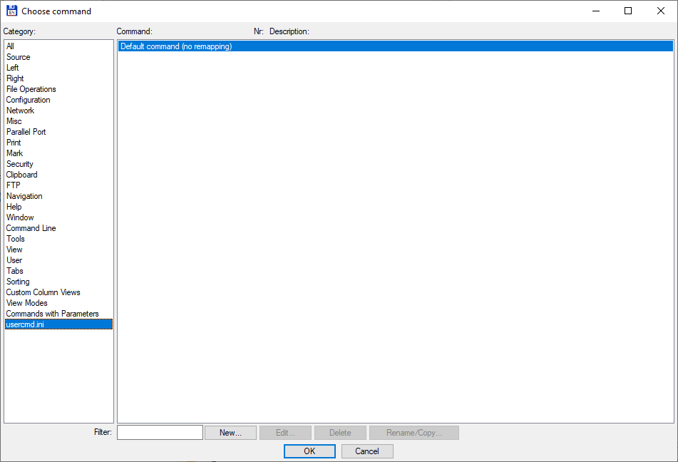
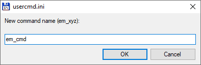
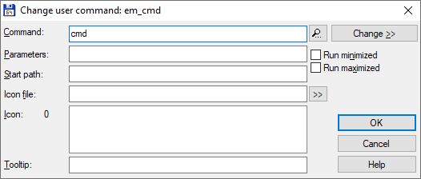
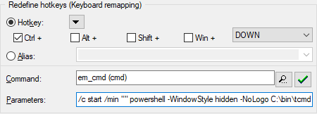
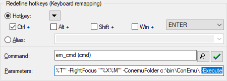

# ConEmu and Total Commander integration

This is a script which syncronize [Total Commander]([url](https://www.ghisler.com/)) panels with [ConEmu]([url](https://conemu.github.io/)) console. It's not as seamless as FAR manager integration, but close.

 <-> 

## Features

- open ConEmu with two separate tabs
- cd to current directory in ConEmu tab from corresponding Total Commander panel
- run scripts and programs in ConEmu
- automatically bring ConEmu window to foreground

## Configuration

1. Download [sync_conemu.ps1]([url](https://github.com/lesha-dev/TcmdConemu/blob/main/sync_conemu.ps1))
3. Create command to just run `cmd`
   
   Open menu _Configuration_ -> _Options_ -> Window _Configuration_ -> Subpanel _Misc._
   
   Add hotkey to run ConEmu instance from current directory - `Ctrl` + `DOWN`
   
   Command: press button with magnifying glass.

   
   
   Window Choose command: select subpanel _usercmd.ini_, press button _New..._

   
   
   Create new command with name, say, _em_cmd_ and command `cmd`.

    ->  
   
   Press OK to return to Configuration window.
5. Configure command to open console
   
   Window Configuration: add Parameters `/c start /min "" powershell -WindowStyle hidden -NoLogo [path to script sync_conemu.ps1] -SourcePath "\"%P\"" -SourceFocus "\"%N\"" -TargetPath "\"%T\"" -TargetFocus "\"%M\"" -LeftPath "\"%X%P\"" -LeftFocus "\"%X%N\"" -RightPath "\"%X%T\"" -RightFocus "\"%X%M\"" -ConemuFolder [path to folder with ConEmu]`

   
   
   Press button with green checkmark
7. Configure command to run scripts and executives in ConEmu
   
   Select hotkey `Ctrl` + `ENTER`
   
   Select command `em_cmd`
   
   Paste all the same Parameters from previous step, add flag `-Execute` in the end

   

9. If the execution of scripts is disabled in powershell, add argument `-ExecutionPolicy bypass`

10. If something is not working as intended, remove parameter `-WindowStyle hidden`, add `-NoExit` and try to read logs in powershell window.

## Command parameters

`cmd /c start /min ""` and `-WindowStyle hidden -NoLogo` - all this is done to run powershell silently without window. Its window still flashes in taskpanel for a moment, so if you've got better solution let me know.

`-SourcePath "\"%P\"" -SourceFocus "\"%N\""`, etc - currently selected directories and files in Total Commander panels. [Read more about Total Commander parameters here](https://softpanorama.org/OFM/Total_commander/total_commander_start_menu.shtml).

Weird parentheses around parameters: `"\"%P\""` - looks like it is the only way to pass file or folder name with spaces, slashes and single quotes to powershell.

`-ConemuFolder` - where your ConEmu binaries are. The script needs both ConEmu.exe and ConEmuC.exe, so it needs path to a folder, not just to an executable.

`-WindowTitle` - title for ConEmu window. One can have multiple instances of ConEmu, so the window should have unique name.

`-Execute` - flag to indicate that focused file needs to be executed in ConEmu.
